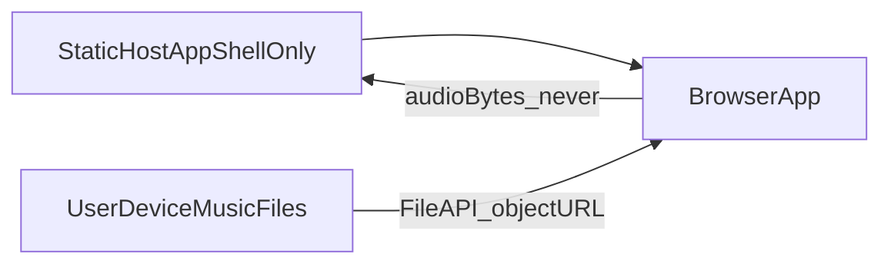
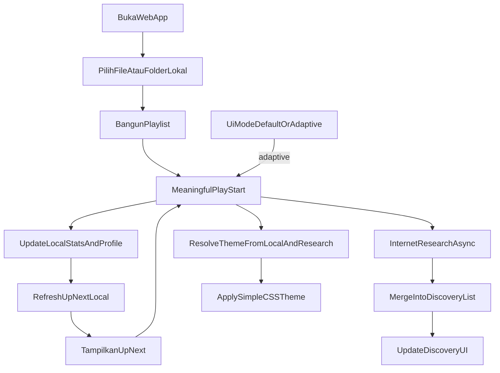
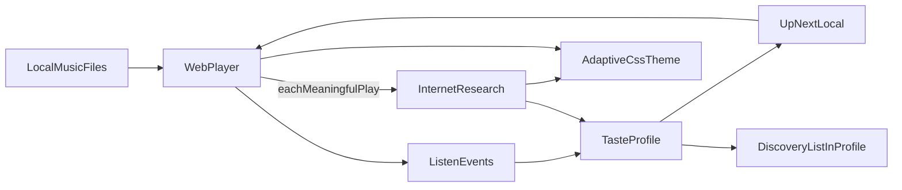

# PRD: Pemutar Musik Web (Lokal)

| Field | Value |
| --- | --- |
| Nama produk | LocalTune (nama kerja) |
| Versi dokumen | 1.6 |
| Status | MVP implemented |
| Tanggal | 2026-08-01 |
| Audiens | Product / engineering / design |
| Perubahan 1.1 | Menambah riset rekomendasi dari sumber internet untuk memperkaya daftar rekomendasi di profil |
| Perubahan 1.2 | Research internet dipicu otomatis pada setiap play bermakna; discovery profil ter-update mengikuti perilaku dengar |
| Perubahan 1.3 | Mempertegas batas hosting: hanya app shell; file musik tidak pernah disimpan di hosting/server |
| Perubahan 1.4 | Profil selera scoped ke browser session (sessionStorage): bertahan refresh, hilang saat tutup tab/browser; isolasi per browser/device tanpa akun |
| Perubahan 1.5 | UI Default vs Adaptif (CSS simple dari sinyal lokal + metadata research); tanpa LLM; tanpa aset UI di server; session reset |
| Perubahan 1.6 | MVP diimplementasikan di `app/` per RFC-001–RFC-005 (Accepted) |

---

## 1. Ringkasan produk

LocalTune adalah aplikasi pemutar musik berbasis web yang berjalan di browser. Pengguna **memutar** file musik dari penyimpanan lokal (komputer/perangkat), tanpa mengunggah file audio ke server dan tanpa akun. **Hosting hanya men-deploy app shell** (HTML/CSS/JS ± proxy research)—bukan koleksi musik pengguna.

Di luar kontrol pemutar minimal, produk membangun **profil selera** dari pola mendengar pengguna (berapa sering lagu/artis/genre diputar, apakah di-skip, apakah diselesaikan). Profil itu dipakai untuk:

1. **Up Next lokal** — mengurutkan lagu berikutnya dari koleksi lokal yang sudah dipilih (siap diputar).
2. **Research update dari internet (otomatis per play)** — setiap kali satu file musik di-play (play start bermakna), sistem mencari saran artis/lagu/album yang selaras dari sumber metadata publik di internet, lalu **menggabungkan (merge)** hasilnya ke **daftar rekomendasi discovery di profil** agar profil terus mengenali perilaku selera pengguna (bukan file audio yang di-stream).
3. **UI Default atau Adaptif** — user memilih tampilan tetap, atau tampilan sederhana yang berubah mengikuti lagu (sinyal genre lokal + metadata rekomendasi internet), **tanpa LLM** dan **tanpa menyimpan aset UI di web server**.

**Nilai unik:** pemutar lokal yang privat untuk playback, profil discovery yang belajar otomatis dari setiap play, plus opsi UI dinamis hemat bandwidth agar tampilan tidak monoton—tanpa akun streaming dan tanpa token AI.

---

## 2. Masalah yang diselesaikan

- Banyak orang punya koleksi MP3/audio lokal, tetapi pemutar bawaan OS kurang nyaman di browser atau tidak memberi saran cerdas.
- Layanan streaming memberi rekomendasi, tetapi membutuhkan akun, koneksi terus-menerus, dan sering mengunci playback di ekosistem mereka.
- User ingin pemutar web sederhana yang “mengerti” selera mereka secara **berkelanjutan saat mendengarkan** (dalam session browser), tetap memutar file milik sendiri, memperbarui daftar rekomendasi profil lewat riset internet, dan opsional melihat **UI yang berubah sederhana** mengikuti lagu—tanpa mengunggah file musik dan tanpa LLM.

---

## 3. Tujuan & non-tujuan

### 3.1 Tujuan (in-scope MVP)

- Memutar file audio lokal di web app yang bisa di-host di tier gratisan.
- Menyediakan kontrol pemutar minimal yang jelas.
- Mencatat perilaku mendengar dan menyimpulkan profil selera.
- Menyarankan urutan lagu berikutnya dari library lokal berdasarkan profil tersebut.
- Melakukan **research update otomatis** dari sumber internet pada **setiap play bermakna**, lalu mengisi/memperbarui (merge) daftar rekomendasi discovery di dalam profil pengguna agar selera terus dikenali.
- Menyediakan pilihan **UI Default** atau **UI Adaptif** (simple, hemat bandwidth) yang mengikuti lagu lewat sinyal lokal + metadata rekomendasi internet—tanpa LLM dan tanpa menyimpan paket UI di server.

### 3.2 Non-tujuan (out of scope v1)

- **Playback streaming** penuh / pemutar resmi Spotify, YouTube Music, Apple Music (memutar audio dari layanan tersebut).
- Akun pengguna LocalTune, login wajib, atau sinkronisasi antar perangkat.
- Upload **file musik** ke server, CDN, atau menyimpan koleksi musik di hosting web.
- Menyimpan **aset UI adaptif** (tema/gambar/pack) di web server atau CDN khusus theme.
- Mengunduh wallpaper/gambar/font/video berat **per play** untuk mengganti tampilan.
- **LLM / token AI** untuk menghasilkan atau mengubah UI, copy, atau gambar tema.
- Equalizer lanjutan, **visualizer spektrum penuh**, atau editor metadata.
- Sosial (share playlist, follow, komentar).
- Lisensi / toko musik / pembelian lagu di dalam app.
- Export/import profil selera (kandidat versi berikutnya).

> Catatan: memanggil API metadata publik (atau proxy serverless tipikal free-tier) untuk **riset rekomendasi** diperbolehkan. Theme adaptif hanya memakai **label metadata** itu + CSS di app shell—bukan generate AI.

---

## 4. Persona & use case

### 4.1 Persona utama

**Raka — kolektor MP3 lokal**  
Usia 20–35, punya folder musik di laptop, sering kerja/belajar sambil dengar lagu. Tidak mau wajib login. Ingin pemutar yang cepat, Up Next dari folder miliknya, discovery yang ter-update tiap play, dan opsi **UI Adaptif** yang berubah sederhana mengikuti lagu agar tidak monoton—tanpa boros kuota dan tanpa AI.

### 4.2 Use case utama

| ID | Use case | Hasil yang diharapkan |
| --- | --- | --- |
| UC-01 | Membuka app dan memilih file/folder musik | Daftar lagu muncul dan siap diputar |
| UC-02 | Memutar, pause, seek, atur volume | Kontrol responsif tanpa lag berarti |
| UC-03 | Next / previous di playlist | Navigasi antar lagu lancar |
| UC-04 | Mendengar beberapa lagu dalam sesi | Sistem mencatat event mendengar |
| UC-05 | Melihat saran “Up Next” lokal | Lagu berikutnya (playable) mencerminkan pola selera |
| UC-06 | Cold start (belum banyak data) | App tetap berguna; fallback ke urutan playlist |
| UC-07 | Play lagu memicu research otomatis | Pada setiap play bermakna, discovery di profil ter-update (merge) dengan saran internet yang selaras seed trek + profil |
| UC-08 | Meninjau rekomendasi profil (discovery) | User melihat item saran (artis/lagu/dll.) tersimpan di profil; item ini **tidak otomatis playable** kecuali file lokalnya sudah ada |
| UC-09 | Memilih mode UI Default atau Adaptif | Mode tersimpan di session; Default = tampilan tetap; Adaptif = UI simple berubah mengikuti lagu |
| UC-10 | Play lagu dengan UI Adaptif aktif | Tampilan berubah hemat-bandwidth sesuai sinyal genre/metadata; tutup browser → mode & state UI adaptif hilang, kunjungan baru mulai dari Default |

---

## 5. Asumsi & batasan teknis

1. **Sumber playback:** hanya file yang dipilih pengguna lewat browser (File API / folder picker). File audio **tidak** diunggah ke server dan **tidak** menjadi artifact di hosting.
2. **Dua lapisan rekomendasi:**
   - **Playable Up Next:** subset library lokal yang sudah dimuat.
   - **Discovery list di profil:** hasil research internet (metadata: nama artis, judul lagu, genre, URL referensi publik bila ada)—disimpan di profil; bukan stream audio.
3. **Research internet (play-triggered):** dipicu pada **setiap play start bermakna** (definisi sama dengan tracking P0; debounce play/pause cepat tetap berlaku). Seed = metadata trek yang sedang diputar (artis/judul/genre bila ada) digabung ringkasan profil (top artis/genre). Hanya label selera yang dikirim, **bukan** byte audio atau path file lokal. Pipeline research **non-blocking**; coalescing in-flight + cache pendek per seed (mis. artis sama) boleh dipakai agar spam next/prev tidak menggandakan call, tetapi **setiap play tetap memicu** pipeline.
4. **Metadata lokal:** judul, artis, album, genre dari tag file (mis. ID3) bila ada; fallback nama file (artis/genre = “Unknown”).
5. **Penyimpanan profil (session-scoped):** statistik, skor, dan daftar discovery disimpan di browser memakai **`sessionStorage`** (dan/atau memori yang di-hydrate darinya). **Refresh tab mempertahankan profil.** **Menutup tab/browser** (akhir session) **menghapus profil**; kunjungan berikutnya mulai dari nol (cold start). Tidak memakai IndexedDB/localStorage untuk taste/discovery. Tidak ada profil server-side bersama antar user—isolasi natural per browser/device/origin tanpa akun.
6. **Hosting = app shell saja:** static site di tier gratis berisi HTML/CSS/JS (dan opsional serverless proxy research). File musik pengguna **bukan** bagian deploy. Fitur inti pemutar **tidak wajib** backend. Fitur research boleh memakai **serverless/proxy opsional** (mis. Netlify/Vercel Functions) untuk menyembunyikan API key—tetap dalam ekosistem free-tier bila memungkinkan.
7. **Browser:** modern (Chrome, Edge, Firefox, Safari terbaru). Folder picker opsional; wajib fallback `<input type="file" multiple accept="audio/*">`.
8. **Format audio (playback):** yang didukung HTML5 Audio di browser target.
9. **Offline:** pemutar + Up Next lokal tetap jalan offline dalam session; research pada play membutuhkan jaringan dan **gagal gracefully** (discovery lama dalam session tetap dipakai).
10. **Jalur playback lokal:** user pilih file → objek `File` / handle di browser → `URL.createObjectURL` → elemen audio. Setelah refresh halaman, user memilih ulang file musik (object URL hilang), sementara **profil selera di sessionStorage tetap**; persist folder handle = later.
11. **Multi-user:** banyak pengguna di browser/device berbeda masing-masing punya profil session sendiri di storage klien mereka; aplikasi tidak membuat akun bersama di hosting.
12. **UI mode (session-scoped):** preferensi Default | Adaptif dan state theme adaptif hidup di `sessionStorage`. Tutup tab/browser menghapusnya; session baru mulai dari **Default**. Theme adaptif = CSS di bundle app; sinyal dari tag lokal + metadata research (reuse, tanpa aset UI di server, tanpa LLM).

### 5.1 Batas hosting

| Di hosting (boleh) | Tidak di hosting (dilarang) |
| --- | --- |
| Aset aplikasi: HTML, CSS, JS, ikon/branding app, **theme CSS tokens di bundle** | File audio / folder musik milik pengguna |
| Opsional: serverless proxy untuk research metadata (API key, CORS) | Upload endpoint atau storage object untuk menyimpan musik user |
| Konfigurasi deploy static (GitHub Pages / Netlify / Vercel) | Salinan, mirror, atau cache audio user di server/CDN |
| | Object URL / blob audio (hanya hidup di memori browser sesi) |
| | Paket tema/gambar UI adaptif tersimpan di server (theme harus di bundle klien) |

---

## 6. Fitur fungsional

### 6.1 P0 — Pemutar minimal

| ID | Requirement | Detail penerimaan |
| --- | --- | --- |
| F-01 | Pilih file / folder lokal | User dapat memilih satu atau banyak file audio; jika folder picker didukung, bisa pilih folder |
| F-02 | Playlist dari pilihan | Semua file valid tampil sebagai daftar (judul/artis bila ada) |
| F-03 | Play / Pause | Tombol play/pause mengontrol trek aktif |
| F-04 | Seek | Progress bar menampilkan posisi; user dapat geser ke waktu tertentu |
| F-05 | Volume | Kontrol volume 0–100% (atau mute) |
| F-06 | Next / Previous | Pindah ke lagu berikutnya/sebelumnya di playlist |
| F-07 | Tampil metadata dasar | Minimal: judul, artis (fallback nama file), durasi |

### 6.2 P0 — Tracking selera

Sistem mencatat event mendengar per lagu (dan agregat per artis/genre bila metadata tersedia):

| Event | Definisi operasional |
| --- | --- |
| Play start | Trek mulai diputar |
| Listen duration | Durasi aktual yang didengar dalam sesi putar tersebut |
| Early skip | User pindah/skip sebelum ~30% durasi lagu (atau sebelum 20 detik jika lagu pendek) |
| Completion | Mendengar ≥ ~80% durasi lagu (atau sampai ended) |
| Play count | Jumlah kali play start yang bermakna (abaikan play-pause berulang dalam beberapa detik) |

Data disimpan di `sessionStorage` browser dan **terakumulasi dalam session tab saat ini**. Refresh mempertahankan data; session baru (setelah tutup tab/browser) mulai dari profil kosong.

### 6.3 P1 — Profil pengguna

Dari akumulasi event, sistem membangun **Taste Profile**:

- Skor preferensi per **artis**
- Skor preferensi per **genre** (jika ada)
- Sinyal per **lagu** (completion rate, skip rate, total listen time)
- Opsional v1 ringan: proxy “energi/tempo” hanya jika metadata tersedia; jika tidak, abaikan tanpa memblokir fitur
- **Daftar rekomendasi discovery** (diisi/diperbarui otomatis oleh research internet pada tiap play — lihat §6.5)

Profil skor diperbarui secara bertahap setelah setiap event relevan. **Setiap play start bermakna** juga memicu research internet (async) yang **meng-merge** hasil ke field discovery.

**Cold start:** jika total play bermakna dalam **session saat ini** &lt; N (disarankan N = 5), profil dianggap “tipis”; UI boleh menampilkan status “Masih belajar selera Anda…”. Up Next lokal memakai fallback sequential. Research internet pada play tetap boleh jalan jika seed trek punya artis/genre ≠ `Unknown`; jika seed hanya `Unknown`, research untuk play itu boleh di-skip tanpa error.

### 6.4 P1 — Rekomendasi lagu berikutnya (playable / lokal)

| ID | Requirement | Detail penerimaan |
| --- | --- | --- |
| F-08 | Up Next berbasis profil | Setelah profil cukup, saran lagu berikutnya diutamakan dari artis/genre ber-skor tinggi dan lagu dengan completion baik |
| F-09 | Kandidat playable hanya lokal | Item yang bisa langsung diputar ⊂ file yang sudah dimuat user |
| F-10 | Fallback cold start | Jika data tipis: ikuti urutan playlist / sequential; jangan menampilkan saran “kosong” yang membingungkan |
| F-11 | Hindari pengulangan berlebih | Lagu yang baru saja diputar tidak langsung disarankan lagi kecuali library sangat kecil |
| F-12 | Transparansi ringan | Opsional: teks singkat alasan saran (mis. “Karena Anda sering menyelesaikan lagu artis X”) |

### 6.5 P2 — Research update rekomendasi dari internet (otomatis per play)

| ID | Requirement | Detail penerimaan |
| --- | --- | --- |
| F-13 | Research otomatis per play | Setiap **play start bermakna** memicu research ke sumber internet; seed = trek yang diputar + ringkasan profil; async dan tidak memblokir audio |
| F-14 | Merge daftar di profil | Hasil riset di-**merge/upsert** ke recommendation list di Taste Profile (judul/artis/genre/sumber/timestamp)—bukan replace buta seluruh daftar |
| F-15 | Bukan playback stream | Item discovery tidak diputar dari internet; jika user punya file lokal yang cocok (fuzzy match artis+judul), boleh ditandai “Ada di library” dan masuk kandidat Up Next |
| F-16 | Privasi seed | Yang dikirim ke layanan eksternal maksimal label trek + agregat selera—bukan file audio, bukan path disk |
| F-17 | Gagal jaringan aman | Timeout/error API tidak merusak pemutar; daftar discovery sebelumnya tetap tampil; status gagal singkat boleh non-intrusif |
| F-18 | Transparansi sumber | Setiap item discovery mencantumkan sumber/waktu update (ringkas) |
| F-19 | Kontrol user | Toggle **opt-out** menonaktifkan research (app tetap lokal-only). Force-refresh manual bersifat sekunder/opsional, bukan jalur utama |
| F-20 | Mitigasi kuota | Coalesce request in-flight untuk seed sama + cache pendek per seed; setiap play tetap memicu pipeline |

**Definisi produk:**

| Jenis | Arti | Playable? |
| --- | --- | --- |
| Up Next | Ranking ulang koleksi lokal | Ya |
| Discovery (profil) | Saran hasil research internet, di-update otomatis tiap play, disimpan di profil | Tidak, kecuali ada file lokal yang match |

### 6.6 P2 — UI Default vs Adaptif (tanpa LLM, hemat bandwidth)

| ID | Requirement | Detail penerimaan |
| --- | --- | --- |
| F-21 | Toggle mode UI | User memilih **Default** atau **Adaptif**; preferensi di `sessionStorage`; session baru kembali ke **Default** |
| F-22 | Adaptif mengikuti lagu | Saat Adaptif aktif, setiap play/ganti trek menerapkan theme simple dari sinyal genre lokal + metadata rekomendasi internet (reuse research; jangan fetch ganda jika research sudah jalan) |
| F-23 | Hemat bandwidth | Theme = CSS variables/kelas di app shell saja; dilarang unduh image/font/video/lottie per play untuk theme |
| F-24 | Tanpa LLM & tanpa storage UI di server | Tidak memakai token/model AI untuk UI; tidak menyimpan paket tema user di hosting |
| F-25 | Reset session | Tutup tab/browser menghapus mode Adaptif + state theme; kunjungan berikutnya mulai UI Default |
| F-26 | Aksesibilitas gerak | Hormati `prefers-reduced-motion` (matikan ambience pulse bila ada); kontras teks tetap terbaca di semua theme |

Jika research di-opt-out: mode Adaptif tetap boleh memakai **tag lokal saja**, atau fallback theme netral jika genre Unknown.

---

## 7. Alur utama (user flow)

### Alur naratif

1. User membuka URL app di hosting gratisan (UI mode = Default).
2. User memilih file/folder musik lokal; opsional mengaktifkan **UI Adaptif**.
3. App menampilkan playlist; user memutar lagu (play start bermakna).
4. Parallel: (a) event mendengar memperbarui skor profil + Up Next lokal; (b) research internet async; (c) jika Adaptif, resolve theme dari tag lokal + metadata research lalu apply CSS simple.
5. Hasil research di-merge ke discovery list di profil; UI discovery diperbarui tanpa menghentikan audio.
6. Play berikutnya mengulangi siklus—profil discovery terus mengenali perilaku selera; theme adaptif mengikuti trek bila mode aktif.
7. Bila file lokal match item discovery, item bisa menjadi kandidat putar.
8. Tutup browser → profil + mode UI adaptif hilang; buka lagi mulai dari Default + profil kosong.

### Diagram konsep data

---

## 8. Persyaratan non-fungsional

| Area | Requirement |
| --- | --- |
| Arsitektur | Pemutar inti client-side; research boleh menambah serverless/proxy opsional di free tier |
| Privasi | File audio tidak dikirim keluar perangkat; research hanya boleh mengirim seed selera/trek labels; toggle opt-out tersedia (F-19) |
| Performa | Mulai putar lagu pertama &lt; ~2 detik setelah dipilih; research & theme apply **tidak memblokir** audio |
| Bandwidth UI | Mode Adaptif tidak menambah fetch media theme; hanya CSS bundle + metadata research yang sudah ada |
| No-LLM UI | Dilarang memakai model/token AI untuk menghasilkan tampilan |
| Responsif | Layout usable di desktop dan mobile browser |
| Aksesibilitas dasar | Kontrol utama bisa dioperasikan keyboard; label tombol jelas |
| Kompatibilitas | Browser modern; degradasi graceful jika folder picker tidak tersedia |
| Hosting | Deployable di tier gratis (static + opsional functions); **hanya app shell**—tanpa penyimpanan file musik user |
| Ketahanan jaringan | Research gagal → pemutar + profil lokal tetap utuh |
| Kuota API | Coalesce + cache pendek per seed (F-20) agar play beruntun tidak spam provider |

---

## 9. Metrik sukses (MVP)

| Metrik | Target kualitatif / operasional |
| --- | --- |
| Time-to-first-play | User dapat memutar lagu dalam maksimal 2 interaksi utama (pilih file → play) |
| Kebergunaan tanpa akun | 100% fitur pemutar + Up Next lokal tanpa login |
| Cold start aman | Saat data &lt; N plays, app tetap memutar sequential tanpa error rekomendasi |
| Relevansi Up Next lokal | Setelah ≥ 15 play bermakna, Up Next terasa lebih cocok dibanding urutan folder |
| Discovery mengikuti play | Setelah beberapa play bermakna berurutan (dengan jaringan), discovery list bertambah/ter-update tanpa aksi manual |
| Relevansi discovery | Setelah research berhasil, ≥ sebagian item discovery selaras seed trek/profil (review manual) |
| Privasi audio | Tidak ada request yang mengunggah file audio |
| Hosting tanpa musik user | Paket deploy / repo hosting tidak berisi file musik pengguna; tidak ada API upload audio; verifikasi review deploy |
| Ketahanan research | Simulasi offline/API down: pemutar tetap jalan; error research tidak menghentikan play |
| Non-blocking | Audio tidak stutter karena research (research di luar critical path play) |
| Profil session: refresh keep | Setelah play dalam session, refresh tab → stats/discovery masih ada |
| Profil session: close reset | Tutup tab/browser lalu buka lagi → profil kosong / cold start |
| Isolasi multi-user | Browser/device berbeda tidak berbagi profil (tanpa akun server) |
| UI Adaptif hemat bandwidth | Tidak ada request image/font/video theme per play; hanya CSS + metadata research yang sudah ada |
| UI mode session reset | Setelah tutup browser, mode kembali Default |

---

## 10. MVP vs versi berikutnya

### 10.1 MVP (v1) — wajib

- Pemutar minimal (F-01 s/d F-07)
- Tracking event (P0)
- Taste profile + Up Next lokal dengan cold-start fallback (F-08 s/d F-12)
- Research otomatis per play → merge discovery di profil (F-13 s/d F-20)
- UI Default vs Adaptif simple (F-21 s/d F-26)
- Deploy ke hosting gratis (static; functions hanya jika perlu untuk research)

### 10.2 Later (bukan komitmen v1)

- Export/import profil & statistik
- Keyboard shortcut lengkap
- PWA / installable offline shell
- Shuffle / repeat mode eksplisit
- Visualizer spektrum penuh (tetap out of MVP; beda dari theme CSS adaptif)
- Persistensi handle folder (File System Access)
- Pengelompokan playlist manual
- Deep link “cari & unduh” ke toko/legal sumber luar (hati-hati kepatuhan)
- Integrasi pemutar streaming resmi
- Persist preferensi UI mode lintas hari (bertentangan session-reset v1)

---

## 11. Risiko & mitigasi

| Risiko | Dampak | Mitigasi |
| --- | --- | --- |
| Metadata ID3 kosong | Profil artis/genre lemah; seed research buruk | Fallback perilaku per-lagu; skip research jika seed hanya Unknown |
| Cold start | Rekomendasi lokal/discovery lemah | Threshold N plays untuk Up Next; research per play tetap boleh jika seed valid |
| File System Access API tidak universal | Folder picker gagal | Fallback multi-file input |
| Tutup tab/browser (akhir session) | Profil + discovery hilang; kunjungan berikutnya cold start | Perilaku yang diinginkan (`sessionStorage`); dokumentasikan di UI |
| Library sangat kecil | Up Next repetitif | Longgarkan anti-ulang; andalkan discovery sebagai inspirasi (non-playable) |
| Format audio tidak didukung | Lagu gagal diputar | Error per item + skip |
| API internet down / kuota / CORS | Research gagal | Proxy serverless opsional; cache; UI error non-blocking |
| Rate-limit / spam API karena tiap play | Kuota habis, latency | Coalesce in-flight + cache pendek per seed (F-20); tetap trigger pipeline per play |
| API key di client | Penyalahgunaan kuota | Jangan hardcode secret di frontend; pakai proxy env di free-tier functions |
| Ekspektasi user “bisa putar saran internet” | Frustrasi | Copy UI jelas: discovery ≠ stream; tandai “Ada di library” jika match |
| Theme adaptif boros bandwidth | Latency / kuota | CSS-only di bundle; larang fetch media theme (F-23) |
| Genre Unknown / research gagal | Theme tidak berubah / stagnan | Fallback theme netral; tetap tidak error |
| Kontras theme buruk | Sulit baca kontrol | Token kontras wajib per themeId; uji gelap/terang |

---

## 12. Persyaratan UI/UX (ringkas)

- Satu komposisi layar utama: daftar lagu + now playing + kontrol + Up Next lokal.
- Area sekunder: ringkasan profil + **daftar rekomendasi discovery** (terpisah visual dari Up Next playable), ter-update otomatis saat play.
- Brand/nama produk jelas di viewport pertama.
- Hindari dashboard padat di hero.
- Up Next dan discovery tidak mengalahkan kontrol putar utama.
- Empty state: “Pilih file musik dari perangkat Anda untuk mulai.”
- Discovery empty/updating/error: “Belum ada saran” / “Memperbarui saran…” / “Gagal memperbarui saran” (non-intrusif).
- Label eksplisit membedakan **Siap diputar** vs **Saran dari internet**.
- Opt-out research mudah ditemukan di pengaturan sekunder.
- Toggle **UI Default | Adaptif** mudah ditemukan; Default tidak pernah memaksa ganti warna per lagu.
- Mode Adaptif: hanya skin/atmosphere CSS; layout struktural sama; brand & kontrol utama tetap hierarki tertinggi.
- Hormati `prefers-reduced-motion`.
- Copy singkat: profil selera & preferensi UI Adaptif berlaku untuk session browser ini (hilang setelah tab/browser ditutup; refresh tidak menghapus dalam session yang sama).
- Jangan gunakan LLM untuk menghasilkan tampilan.

---

## 13. Open questions (untuk implementasi / RFC)

1. Nama final produk (LocalTune hanya nama kerja).
2. ~~Nilai pasti threshold cold start~~ — **diputuskan:** 5 plays bermakna per session (RFC-003).
3. ~~Bobot rumus skor artis/genre/lagu~~ — **ditentukan** di RFC-003 (bobot default MVP).
4. ~~Provider research default~~ — **diputuskan:** MusicBrainz via proxy opsional (RFC-004).
5. ~~TTL cache & merge discovery~~ — **diputuskan:** TTL 6 jam in-session, merge upsert max 50 item (RFC-004).

> Frekuensi research: **diputuskan** — otomatis pada setiap play start bermakna (bukan manual sebagai jalur utama).

**Implementasi:** lihat [`app/`](../app/) dan RFC-001–RFC-005 (status Accepted).

---

## 14. Ringkasan keputusan produk

| Aspek | Keputusan |
| --- | --- |
| Platform | Web app, host gratisan (static ± functions opsional) |
| Isi hosting | App shell saja; **bukan** penyimpanan file musik |
| Sumber playback | File lokal di perangkat user via File API / object URL; tidak di-upload ke server |
| Lingkup UI pemutar | Minimal: buka file/folder → playlist → play/pause → seek → volume → next/prev |
| Up Next | Ranking koleksi lokal berdasarkan profil |
| Discovery | Research internet **otomatis tiap play bermakna**; merge ke daftar rekomendasi di profil |
| UI | Toggle **Default** vs **Adaptif**; Adaptif = CSS simple dari genre lokal + metadata research; tanpa LLM; tanpa aset UI di server |
| Masa hidup profil & UI mode | `sessionStorage`: bertahan refresh; hilang saat tutup tab/browser; UI mode kembali Default di session baru |
| Isolasi user | Per browser/device/origin tanpa akun; tidak ada profil bersama di server |
| Diferensiator | Profil selera + Up Next lokal + discovery internet + opsi UI dinamis hemat bandwidth |
| Backend | Tidak wajib untuk pemutar; boleh proxy opsional untuk research (bukan storage musik/UI theme) |

---

*Dokumen ini menjadi acuan implementasi MVP dan RFC terkait. Fokusnya adalah “mengapa” dan “apa”; detail provider API dan stack ditentukan di RFC.*
