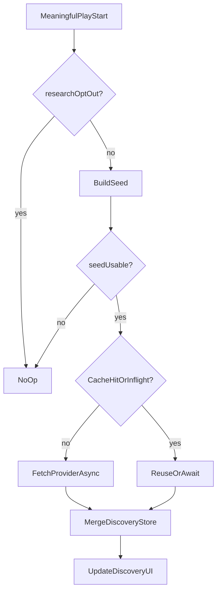

# RFC-004: Research Internet Play-Triggered & Discovery Profil

| Field | Value |
| --- | --- |
| Status | Accepted |
| Tanggal | 2026-08-01 |
| Penulis | Agent |
| PRD terkait | [docs/PRD-music-player.md](../PRD-music-player.md) (§6.5 F-13–F-20, UC-07–UC-08, §5.1 Batas hosting) |
| Dependensi RFC | [RFC-002](RFC-002-listen-events-taste-storage.md), [RFC-003](RFC-003-taste-profile-up-next.md) (seed profil); hooks play dari [RFC-001](RFC-001-static-web-player-core.md) |

## 1. Ringkasan

Pada **setiap meaningful play start**, LocalTune menjalankan **research metadata** ke sumber internet (async, non-blocking), lalu **meng-merge** hasil ke **discovery list** di Taste Profile (**sessionStorage**: bertahan refresh, hilang saat tutup tab/browser).

Item discovery adalah saran artis/lagu (bukan stream). Playback tetap file lokal; hosting tidak menyimpan musik user. Proxy serverless opsional hanya untuk API key/CORS research.

## 2. Motivasi

| PRD | Keputusan RFC |
| --- | --- |
| F-13 Research otomatis per play | Trigger = meaningful play start |
| F-14 Merge daftar di profil | Upsert, bukan replace buta |
| F-15 Bukan playback stream | Discovery non-playable kecuali fuzzy match lokal |
| F-16 Privasi seed | Hanya labels, bukan audio/path |
| F-17 Gagal jaringan aman | Soft-fail |
| F-18 Transparansi sumber | source + timestamp |
| F-19 Opt-out | Toggle; force-refresh sekunder |
| F-20 Mitigasi kuota | Coalesce + cache pendek per seed |
| UC-07 / UC-08 | Auto-update & tinjau discovery |

## 3. Usulan

### 3.1 Modul

| Modul | Tanggung jawab |
| --- | --- |
| `researchTrigger` | Dengarkan meaningful play; hormati opt-out & Unknown skip |
| `researchClient` | Panggil provider (via proxy atau public API) |
| `discoveryStore` | Persist list di **sessionStorage** (JSON); refresh keep, close reset |
| `discoveryUi` | Tampilkan list, status updating/error, badge “Ada di library” |
| `settings` | Toggle `researchOptOut` di **sessionStorage** |

### 3.2 Provider default (dikunci untuk MVP)

- **Primary:** [MusicBrainz](https://musicbrainz.org/) API — cari recording/artist mirip dari seed artis (+ judul bila ada); patuhi rate limit & User-Agent wajib.
- **Tidak memakai** Spotify/YouTube/Apple sebagai sumber playback.
- Jika MusicBrainz tidak cukup untuk “similar”: gunakan relasi artist-credit / tag genre MusicBrainz untuk kandidat terkait; jangan hardcode secret di frontend.
- **Proxy:** bila perlu Custom User-Agent terpusat atau kelak API ber-key, pakai satu serverless function `GET /api/research?artist=&title=` di free tier; function **tidak** menerima upload audio.

### 3.3 Seed request

```text
ResearchSeed {
  artist: string,
  title: string,
  genre?: string,
  topArtists: string[],  // dari TasteProfile, max 3
  topGenres: string[]    // max 3
}
```

Skip research jika `artist === "Unknown" && !usableTitle` (judul kosong/bermakna file mentah tanpa sinyal).

## 4. Detail desain

### 4.1 Trigger pipeline (per play)



- Parallel dengan update stats RFC-002; **jangan** await research sebelum `audio.play()`.
- Cache key: `normalize(artist) + "|" + normalize(title)` (atau artist-only jika title lemah).
- **TTL cache default: 6 jam** per seed **dalam session** (in-memory + boleh mirror di sessionStorage); hilang saat session berakhir.
- In-flight map: play beruntun seed sama menunggu promise yang sama (coalesce).

### 4.2 Model discovery item

```text
DiscoveryItem {
  id: string,              // stable hash source+artist+title
  artist: string,
  title?: string,
  genre?: string,
  source: "musicbrainz",
  sourceUrl?: string,
  reason?: string,         // singkat
  updatedAt: number,
  inLocalLibrary: boolean  // dihitung saat refresh vs library sesi
}
```

### 4.3 Merge policy

- Upsert by `id`.
- Cap daftar **max 50** item; evict LRU by `updatedAt` jika penuh.
- Jangan hapus seluruh list saat satu request gagal.
- Dedupe case-insensitive artist+title.

### 4.4 Fuzzy match lokal (F-15)

```text
inLocalLibrary = library.some(t =>
  norm(t.artist) === norm(item.artist) &&
  (!item.title || norm(t.title) === norm(item.title))
)
```

Jika match: badge “Ada di library”; boleh ditambahkan ke kandidat Up Next oleh UI (tetap file lokal yang diputar)—tidak memutar URL internet.

### 4.5 Opt-out & UI

- `sessionStorage.researchOptOut = "1"` (atau key dalam blob settings session).
- Default: research **aktif**.
- UI sekunder: toggle “Perbarui saran dari internet saat memutar”.
- Force-refresh: opsional memanggil pipeline dengan `bypassCache` untuk seed current track.
- Status: idle / updating / error (non-intrusif).
- Copy: discovery ikut profil session (hilang setelah tutup tab/browser).

### 4.6 Privasi & hosting

- Payload keluar: labels seed saja.
- Discovery + opt-out di `sessionStorage` (bukan IndexedDB/localStorage).
- Tidak ada penyimpanan musik di hosting; tidak ada profil server bersama antar user.
- Proxy tidak log body audio (tidak ada audio).

## 5. Alternatif yang dipertimbangkan

| Alternatif | Alasan ditolak / ditunda |
| --- | --- |
| Research hanya manual berkala | Bertentangan PRD v1.2 (per play) |
| Spotify Recommendations API | Butuh akun/app secret; mendekati streaming ecosystem; ditunda |
| Stream preview audio dari internet | Melanggar non-playback-stream & kompleksitas lisensi |
| Ganti seluruh discovery tiap response | Hilangkan histori belajar; PRD minta merge |
| Tanpa cache | Risiko rate-limit MusicBrainz pada skip cepat |

## 6. Dampak

| Area | Dampak |
| --- | --- |
| Privasi | Seed labels ke MusicBrainz/proxy; opt-out tersedia |
| Performa | Async; cache/coalesce melindungi UI & kuota |
| Hosting | App shell + opsional `/api/research`; bukan storage musik |
| Offline | Research gagal soft; pemutar + discovery lama OK |

## 7. Rencana implementasi (tinggi)

1. `discoveryStore` sessionStorage + merge/cap 50  
2. `researchClient` MusicBrainz (+ proxy bila perlu User-Agent)  
3. `researchTrigger` on meaningful play + opt-out + Unknown skip  
4. Cache TTL dalam session + inflight coalesce  
5. UI discovery + badge match + toggle  
6. Uji: play → list bertambah; refresh → list tetap; session baru → list kosong; offline play → audio OK; opt-out → no network research  

## 8. Risiko & mitigasi

| Risiko | Mitigasi |
| --- | --- |
| Rate limit MusicBrainz | Cache 6h, coalesce, delay sopan, User-Agent jelas |
| CORS dari browser | Proxy serverless |
| Hasil tidak relevan | Seed pakai artis trek + top profil; tampilkan source |
| User kira bisa diputar | Copy “Saran dari internet” vs “Siap diputar” |
| API down | Soft-fail; keep list |

## 9. Open questions

Tidak ada yang memblokir MVP. Provider tambahan (Last.fm dll.) boleh RFC baru jika MusicBrainz tidak memadai di evaluasi.

> Konsumen hilir: [RFC-005](RFC-005-adaptive-ui-themes.md) boleh memakai label genre dari hasil research sebagai hint theme (tanpa fetch media tambahan).

## 10. Acceptance criteria

- [ ] Setiap meaningful play (research aktif, seed usable) memicu pipeline async tanpa memblokir audio  
- [ ] Hasil di-merge ke discovery; **refresh** mempertahankan list (`sessionStorage`); **session baru** setelah tutup tab/browser = list kosong  
- [ ] Opt-out (sessionStorage) menghentikan call research; pemutar + Up Next lokal tetap jalan  
- [ ] Seed Unknown di-skip tanpa error  
- [ ] Cache/coalesce mencegah spam call untuk seed sama dalam TTL session  
- [ ] Item discovery tidak di-stream; badge “Ada di library” jika match  
- [ ] Tidak ada upload file musik ke hosting; proxy hanya metadata  
- [ ] Error jaringan menampilkan status non-intrusif; list lama dalam session tetap ada  
