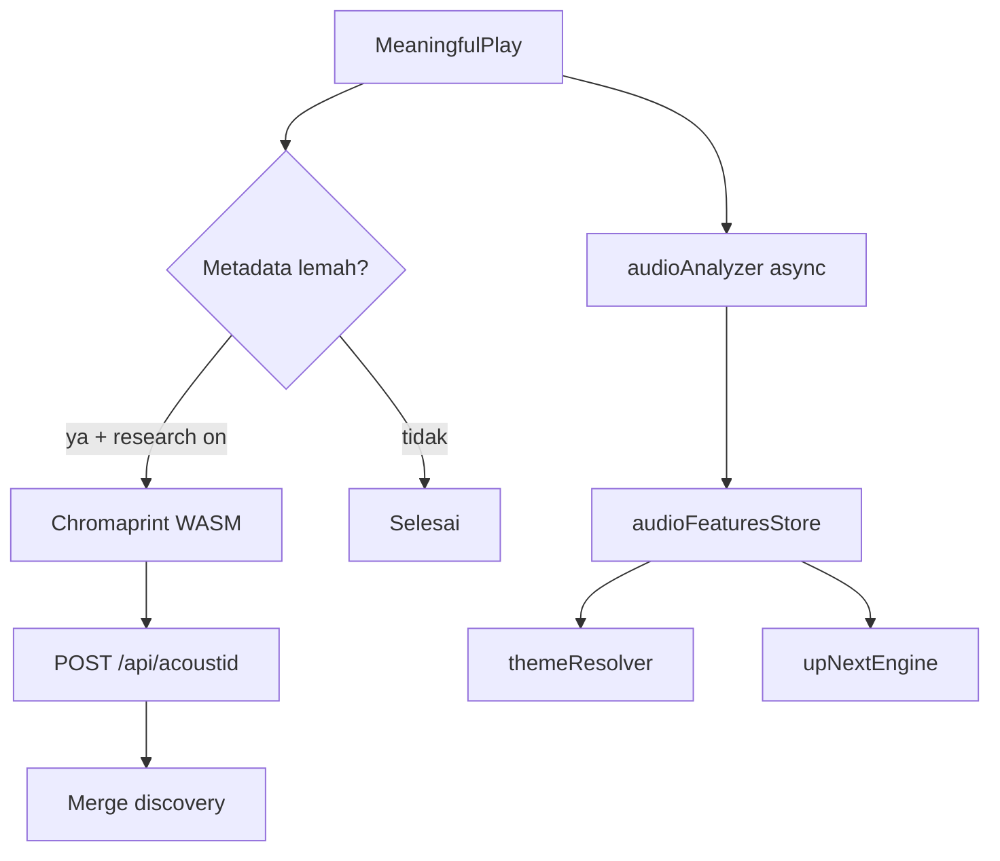

# RFC-006: Analisis Audio Lokal & Fingerprint (AcoustID)

| Field | Value |
| --- | --- |
| Status | Accepted |
| Tanggal | 2026-08-01 |
| Penulis | Agent |
| PRD terkait | [docs/PRD-music-player.md](../PRD-music-player.md) (§6.5 discovery, §6.6 UI adaptif, F-13–F-15) |
| Dependensi RFC | [RFC-004](RFC-004-internet-research-discovery.md), [RFC-005](RFC-005-adaptive-ui-themes.md), [RFC-003](RFC-003-taste-profile-up-next.md) |

## 1. Ringkasan

LocalTune menambah **dua lapisan pembacaan audio** untuk discovery & personalisasi:

1. **Analisis lokal (Web Audio)** — tempo, energi, kecerahan spektral, mood; **tanpa jaringan**; disimpan di `sessionStorage`.
2. **Fingerprint AcoustID (Chromaprint WASM)** — sidik jari dihitung di browser; hanya **hash + durasi** dikirim ke proxy `/api/acoustid` bila metadata teks lemah dan research tidak di-opt-out.

Keduanya melengkapi ID3 + MusicBrainz (RFC-004), bukan menggantikan.

## 2. Motivasi

| Masalah | Solusi RFC |
| --- | --- |
| Banyak file tanpa tag ID3 → discovery kosong | Fingerprint identifikasi artis/judul |
| Genre `Unknown` → UI adaptif netral | Mood dari analisis spektral lokal |
| Up Next hanya teks | Boost trek dengan energi/mood serupa |

## 3. Usulan

### 3.1 Modul

| Modul | Tanggung jawab |
| --- | --- |
| `audioAnalyzer` | Decode cuplikan audio → fitur numerik + mood |
| `audioFeaturesStore` | `sessionStorage` key `localtune:audioFeatures:v1` |
| `fingerprintEngine` | Chromaprint WASM + lookup AcoustID via proxy |
| `audioIntelTrigger` | Picu analisis/fingerprint pada meaningful play & tag update |
| `themeResolver` | Gabung mood audio ke `themeId` (setelah genre) |
| `upNextEngine` | Bonus skor kandidat dengan mood/energi mirip |

### 3.2 Privasi

| Data | Keluar perangkat? |
| --- | --- |
| PCM / file audio | **Tidak** |
| Fitur audio (angka) | **Tidak** — hanya sessionStorage |
| Fingerprint + durasi | **Ya** — ke AcoustID via proxy, hanya jika research aktif & metadata lemah |
| Opt-out research (RFC-004) | Mematikan **juga** lookup AcoustID |

### 3.3 Alur



## 4. Detail desain

### 4.1 Analisis lokal

Cuplikan: maks **45 detik** awal trek (cukup untuk mood; hemat CPU).

```text
AudioFeatures {
  trackKey, energy (0–1), brightness (0–1),
  tempoBpm?: number, mood: energetic|calm|bright|warm|balanced,
  analyzedAt
}
```

Mood deterministik dari ambang energi + brightness (tanpa ML).

### 4.2 Fingerprint

- Library: `@unimusic/chromaprint` (WASM, ~160KB bundle).
- Trigger: `artist === Unknown` **atau** `isSeedUsable` gagal untuk teks.
- Proxy: `ACOUSTID_API_KEY` di Netlify env (bukan di frontend).
- Hasil: merge ke discovery dengan `source: "acoustid"`.

### 4.3 Integrasi tema & Up Next

Prioritas theme: genre research → genre ID3 → **mood audio** → neutral.

Up Next: +0.1 skor normalisasi jika mood/energy bucket sama dengan trek current.

## 5. Alternatif yang dipertimbangkan

| Alternatif | Alasan ditolak |
| --- | --- |
| Upload audio ke server untuk analisis | Melanggar privasi / hosting |
| ML genre cloud | Butuh upload + biaya |
| Fingerprint tanpa opt-out | Kirim data ke pihak ketiga harus ikut toggle research |
| IndexedDB fitur audio | Bertentangan session-scoped v1 |

## 6. Dampak

| Area | Dampak |
| --- | --- |
| Bundle | +~160KB WASM chromaprint (lazy load) |
| CPU | Analisis async; tidak block `audio.play()` |
| Netlify | Function `acoustid` + env `ACOUSTID_API_KEY` |
| Tanpa API key | Analisis lokal tetap jalan; fingerprint skip soft |

## 7. Rencana implementasi

1. `audioAnalyzer` + `audioFeaturesStore`
2. Lazy `fingerprintEngine` + `/api/acoustid` proxy
3. `audioIntelTrigger` wire meaningful play
4. Hook `themeResolver` + `upNextEngine`
5. UI: indikator mood; discovery badge AcoustID
6. Dokumentasi env Netlify

## 8. Risiko & mitigasi

| Risiko | Mitigasi |
| --- | --- |
| WASM gagal di browser lama | Fallback: hanya analisis lokal |
| AcoustID quota | Cache fingerprint per trackKey session |
| Decode lambat | Batas 45s; satu job per trek |

## 9. Open questions

Tidak ada. API key AcoustID gratis di [acoustid.org/new-application](https://acoustid.org/new-application).

## 10. Acceptance criteria

- [x] Analisis lokal menghasilkan mood/energy tanpa network
- [x] Fitur tersimpan di sessionStorage; hilang saat tutup tab
- [x] Fingerprint hanya saat metadata lemah + research aktif
- [x] Yang keluar internet: fingerprint + durasi, bukan file audio
- [x] Discovery terisi dari AcoustID bila match
- [x] UI adaptif & Up Next memakai mood audio
- [x] Opt-out research mematikan AcoustID lookup
